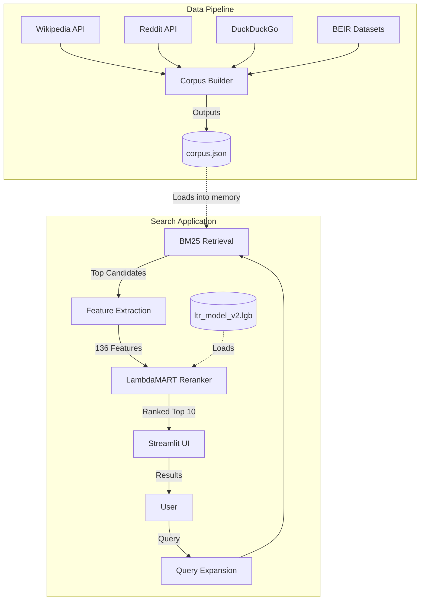

# 🔍 LTR Search Engine — Streamlit Edition

A full-fledged search engine powered by **BM25 retrieval** and **LambdaMART reranking** over a multi-source dynamic corpus, deployed as a Streamlit app.

## Architecture & System Diagram

The system executes a fast in-memory pipeline: it expands user queries, retrieves candidate documents using a BM25 index over a pre-built corpus, extracts 136 heuristic features (without relying on heavy neural network embeddings), and finally reranks them using a LightGBM LambdaMART model.



## Project Structure

```
search-engine-streamlit/
├── app.py              # Streamlit app (UI + search pipeline logic)
├── corpus.py           # Multi-source corpus builder (Wikipedia, Reddit, DDG, BEIR)
├── retriever.py        # BM25 index and retrieval
├── features.py         # 136-feature extraction logic (no PyTorch dependencies)
├── ranker.py           # LambdaMART reranking with LightGBM
├── ltr_model_v2.lgb    # Pre-trained LambdaMART model (committed to repo)
├── corpus.json         # Pre-built unified corpus (committed to repo)
├── requirements.txt    # Streamlit Cloud compatible dependencies
└── .streamlit/
    └── config.toml     # Streamlit theme configuration
```

## Data Sources

The `corpus.py` script dynamically fetches and unifies documents from four distinct sources to generate a diverse `corpus.json` file:
- **Wikipedia:** Discovers articles dynamically from 12 seed categories.
- **Reddit:** Pulls recent hot/top discussions from multiple technical subreddits.
- **DuckDuckGo:** Scrapes snippet results from curated tech/gadget queries.
- **BEIR:** Integrates academic and scientific documents from SciFact and MS MARCO subsets.

## Local Development

```bash
pip install -r requirements.txt
streamlit run app.py
```
*(To force-rebuild the corpus from all sources, run: `python corpus.py --rebuild` or `streamlit run app.py -- --rebuild`)*

## Deploy to Streamlit Community Cloud

1. **Pre-build corpus** locally (only needed once):
   ```bash
   python corpus.py
   ```

2. **Commit everything** to GitHub, including:
   - `corpus.json` (pre-built unified corpus, ~9MB)
   - `ltr_model_v2.lgb` (trained model, ~7.6MB)

3. Go to [share.streamlit.io](https://share.streamlit.io) → **New app** → point to `app.py`

4. No secrets or environment variables needed.

## Important Notes

- **No torch/transformers** — The application runs within the strict limits of the free tier (~1GB RAM). `USE_SEMANTIC = False` in `features.py` enforces fast text-overlap heuristics instead of heavy neural embeddings.
- **Pre-built Corpus** — `corpus.json` must be pre-built locally and committed; the application will not perform live web scraping at runtime for individual searches.
- **Caching** — All heavy objects (corpus, BM25 index, LightGBM model) are cached in memory via `@st.cache_resource` for optimal query speed.
